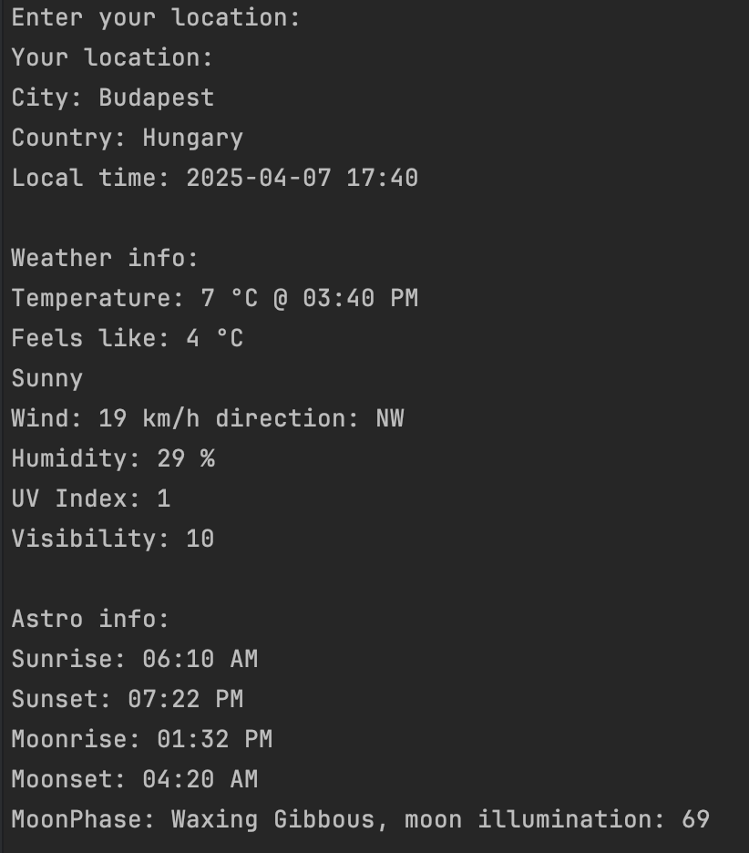

# CLIW 
Console line interface weather app, fetching weather information from WeatherStack Free API.

## Requirements
- **DOTNET 9.0**: Usually comes with your IDE. Or install it manually.
   
  On mac:
  ``` zsh
  brew install --cask dotnet
  ```

  On Windows:
  [download](https://dotnet.microsoft.com/en-us/download/dotnet/9.0)
  
- [**DotNetEnv nuget package**](https://www.nuget.org/packages/DotNetEnv):
  Enter the command below into the terminal in your project folder.
  
  ``` zsh
  dotnet add package DotNetEnv
  ```

## API key

Register on [weatherstack.com](https://weatherstack.com/) to get your API key.

Create a **.env** file into /your_project/bin/Debug/net9.0 and put your API Key into it.  
`API_KEY=your_api_key`

## Example output
We use the default location below, that's why we didn't enter anything.



Forecast is only available for Professional Plan and higher tier subscriptions.

## Contribution

If you would like to contribute to the project, you can find the [documentation](https://weatherstack.com/documentation) here.
